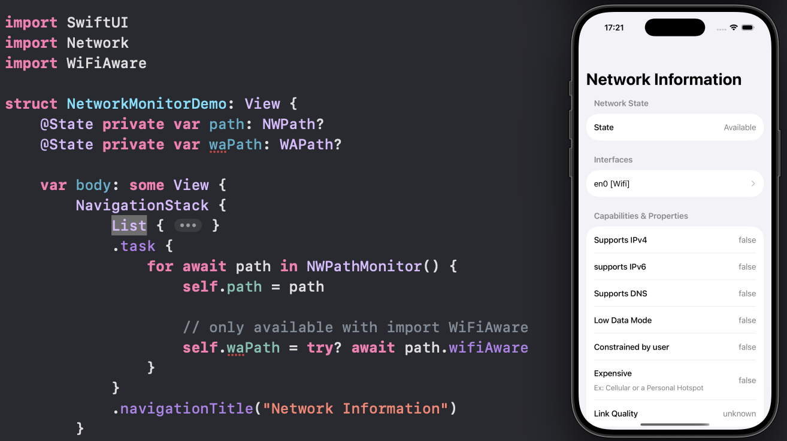

# SwiftUI_NetworkInformation

Get/monitor network information with network framework `NWPathMonitor`.

For more details, please check out my blog [Little SwiftUI Tip: Get Network Information & Monitor Changes]().

